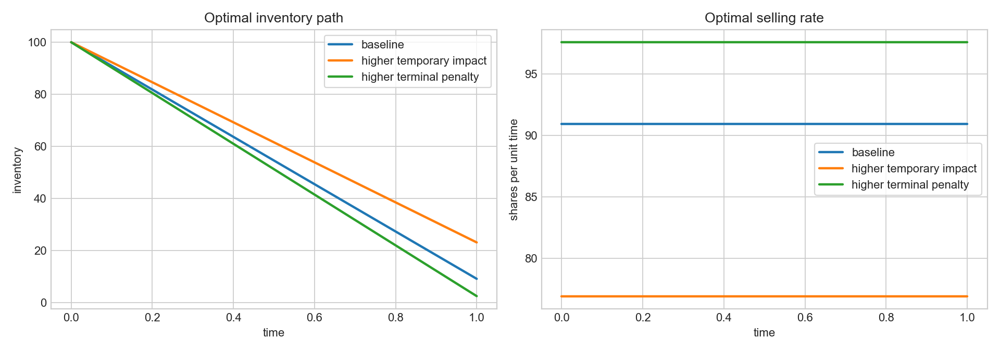
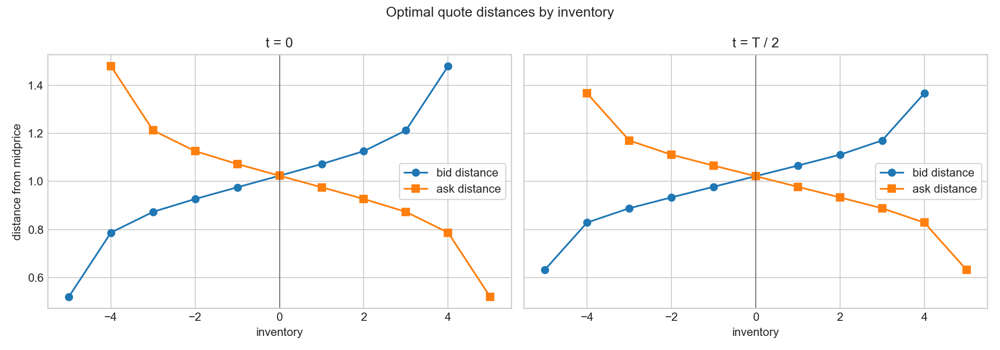
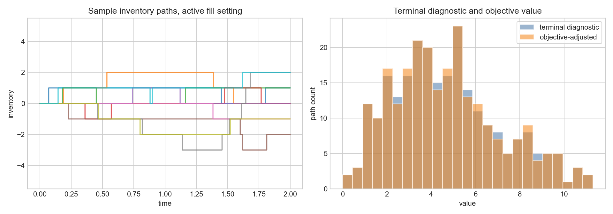

# Results Discussion

This note interprets the numerical outputs produced by the notebook. The complete mathematical statement is in [model_specification.md](model_specification.md); this file focuses on what was computed, what the figures show, and what should not be inferred.

The results are properties of two stylized stochastic-control models. They are not evidence of live trading profitability, exchange calibration, or production market-making readiness.

## 1. Optimal Liquidation

The liquidation routine implements the no-permanent-impact closed-form policy. Inventory follows

$$
dQ_t=-a_t\,dt,
$$

cash follows

$$
dX_t=a_t(S_t-\kappa a_t)\,dt,
$$

and the terminal objective is

$$
\mathbb{E}\left[
X_T+Q_T S_T-\theta Q_T^2
\right].
$$

The implemented optimal rate is

$$
a^*(t,q)=-\frac{\gamma(t)}{\kappa}q,
\qquad
\gamma(t)=-
\left(\frac{1}{\theta}+\frac{T-t}{\kappa}\right)^{-1}.
$$

This gives the deterministic inventory path

$$
Q(t)=Q(0)\frac{\kappa/\theta+T-t}{\kappa/\theta+T}.
$$

The liquidation figure compares three parameter settings:

| Scenario | Terminal inventory | Selling rate |
|---|---:|---:|
| Baseline | 9.091 | 90.909 |
| Higher temporary impact | 23.077 | 76.923 |
| Higher terminal penalty | 2.439 | 97.561 |

The directions are economically consistent:

- increasing `theta` makes residual inventory more expensive, so the policy liquidates more aggressively;
- increasing `kappa` makes fast execution more expensive, so the policy slows down and leaves more inventory at the horizon;
- terminal inventory is generally nonzero because the model uses a finite penalty, not a hard liquidation constraint.

The selling rate is constant along each optimal path in this specific formulation. That is not a universal feature of liquidation models; it follows here from no permanent price impact, no running inventory-risk penalty, and the quadratic terminal inventory penalty. Midprice volatility affects simulated cash and terminal marked-to-market value, but it does not change the deterministic optimal schedule in this risk-neutral setup.

## 2. Limit-Order Market Making

The market-making routine solves the symmetric finite-grid Bellman reduction. The model state is midprice, cash, and inventory. Bid fills increase inventory and reduce cash; ask fills reduce inventory and increase cash:

$$
\begin{aligned}
dQ_t &= \Delta\,dN_t^b-\Delta\,dN_t^a, \\
dX_t
&= -\Delta(S_t-\delta_b)\,dN_t^b
   + \Delta(S_t+\delta_a)\,dN_t^a.
\end{aligned}
$$

Fill intensities are

$$
\lambda e^{-\kappa\delta_b},
\qquad
\lambda e^{-\kappa\delta_a}.
$$

The value function is reduced with

$$
v(t,S,x,q)=x+Sq+\theta(t,q),
\qquad
\theta(t,q)=\frac{\Delta}{\kappa}\log W(t,q).
$$

This is why the code can solve a finite-dimensional ODE for `W` rather than a full PDE. Since the ansatz is linear in `S`, midprice volatility affects simulated marked-to-market outcomes but drops out of the quote policy.

The optimal quote distances are computed from neighboring inventory values:

$$
\begin{aligned}
\delta_b^*(t,q)
&= \frac{1}{\kappa}
   - \frac{\theta(t,q+\Delta)-\theta(t,q)}{\Delta}, \\
\delta_a^*(t,q)
&= \frac{1}{\kappa}
   - \frac{\theta(t,q-\Delta)-\theta(t,q)}{\Delta}.
\end{aligned}
$$

These formulas are used in the interior-positive regime only. At the upper inventory boundary, the bid is suppressed; at the lower boundary, the ask is suppressed. The implementation raises an error if finite quote distances become nonpositive for the chosen parameters.

### Quote Skew

At zero inventory, the bid and ask distances are symmetric. In the baseline parameter setting, both are approximately `1.024` at `t = 0`.

At positive inventory, the model encourages selling and discourages further buying. At `q = 4`, the `t = 0` bid distance is approximately `1.480`, while the ask distance is approximately `0.788`. The wider bid lowers the probability of buying more inventory; the tighter ask raises the probability of selling.

At negative inventory, the skew reverses. At `q = -4`, the `t = 0` bid distance is approximately `0.788`, while the ask distance is approximately `1.480`.

This quote skew is the main economic content of the market-making example: inventory changes the relative aggressiveness of bid and ask quotes, while the symmetric setup preserves mirror symmetry around zero inventory.

### Simulation Summary

The simulation uses a first-event time discretization to approximate the controlled Poisson fills. With the active visualization setting in the notebook, terminal inventory across 250 paths has mean approximately `0.056` and standard deviation approximately `1.847`.

Terminal marked-to-market value has mean approximately `4.699` and standard deviation approximately `2.443`. The discretized running inventory penalty has mean approximately `0.018`; after subtracting it, the objective-adjusted value has mean approximately `4.681` and standard deviation approximately `2.437`.

These values are diagnostics, not performance estimates. They show that the simulated paths respect inventory bounds, that cash signs are consistent with buys and sells, and that the quote policy generates inventory-dependent fill behavior. The objective-adjusted value is closer to the Bellman objective than the terminal diagnostic, but it is still a simulation output under a stylized fill model rather than an empirical PnL estimate.

### Bellman Value Sanity Check

The solved Bellman equation gives the model value at the initial state as

$$
v(0,S_0,x_0,q_0)=x_0+S_0q_0+\theta(0,q_0).
$$

For the default market-making parameters with `T = 1`, `lambda = 1.5`, `q0 = 0`, and `x0 = 0`, this value is approximately `1.080`.

Using the same policy in the first-event simulator with `400` paths, `300` time steps, and fixed seed `2024`, the objective-adjusted sample mean is approximately `1.076` with Monte Carlo standard error approximately `0.054`. A deliberately wide four-standard-error interval is approximately `[0.859, 1.292]`, which contains the Bellman value.

This is a numerical sanity check, not a convergence theorem. Its purpose is to catch sign mistakes or payoff-accounting mismatches by connecting the solved value-function term to the simulated controlled payoff under the same stylized model.

## 3. Implementation Notes and Limitations

The implementation is intentionally direct:

- liquidation uses the Riccati closed form rather than a generic HJB solver;
- market making solves the transformed ODE by matrix exponential on a finite inventory grid;
- simulations use fixed random seeds for reproducibility;
- tests check terminal conditions, comparative statics, quote symmetry, boundary quote suppression, positive finite quotes, inventory bounds, cash-update signs, objective-value accounting, Bellman-value simulation consistency, and deterministic reproducibility.

The main limitations are explicit:

- no calibration to real exchange data;
- no tick size, queue position, latency, fees, adverse selection, hidden liquidity, or order-book state;
- symmetric fill intensities and symmetric exponential decay;
- finite inventory grid with boundary quote suppression;
- first-event simulation of continuous-time Poisson arrivals;
- at most one fill can occur within each discrete simulation step.

These limitations are consistent with the project goal: a transparent implementation of two stochastic-control trading examples, not a claim of market-making alpha.
